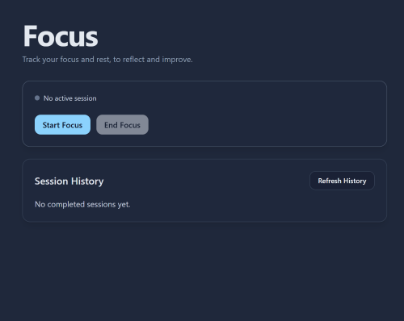
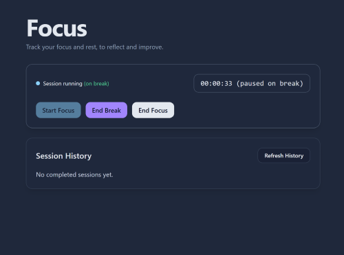
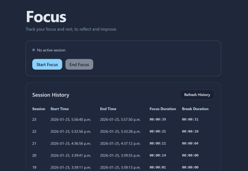

# Focus - Frontend (React)

This repository contains the frontend of **Focus**, a full-stack web application designed to assist users in tracking focused work sessions and breaks. 

The frontend provides a responsive and user-friendly interface that allows users to:
- Start and end focus sessions
- Pause focus time during breaks
- View real-time stopwatch for focus duration
- Review past session history

Communication with the backend is done via JSON-based HTTP requests to a RESTful API built in ASP.NET Core, ensuring accuracy and persistence in session data.

### Tech Stack
- React
- Vite
- JavaScript
- Tailwind CSS
- Git

### How to Run (Frontend)
1. Clone the repository
2. Navigate to the folder (cd focus-frontend)
3. Install dependencies (npm install)
4. Start the development server (npm run dev)
5. Open the app in the browser (http://localhost:5173)
Note: port may change if another service is using 5173.

### 📸Demonstration UI
Application Flow
  
  
  
  
  
